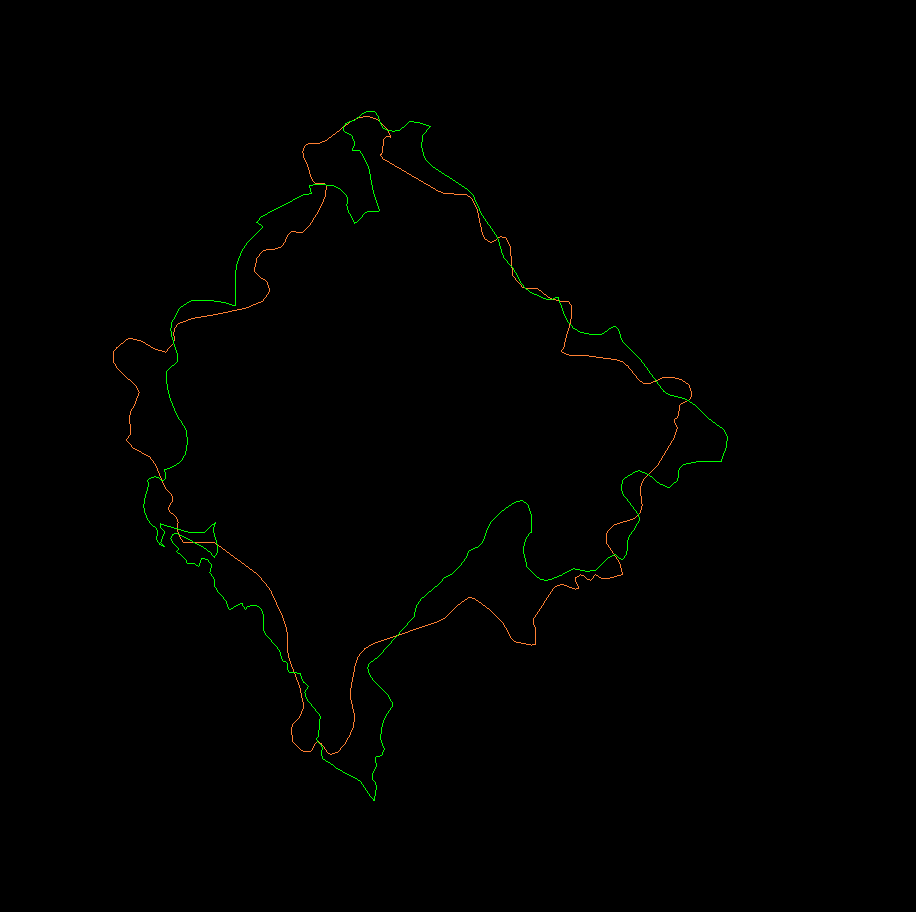
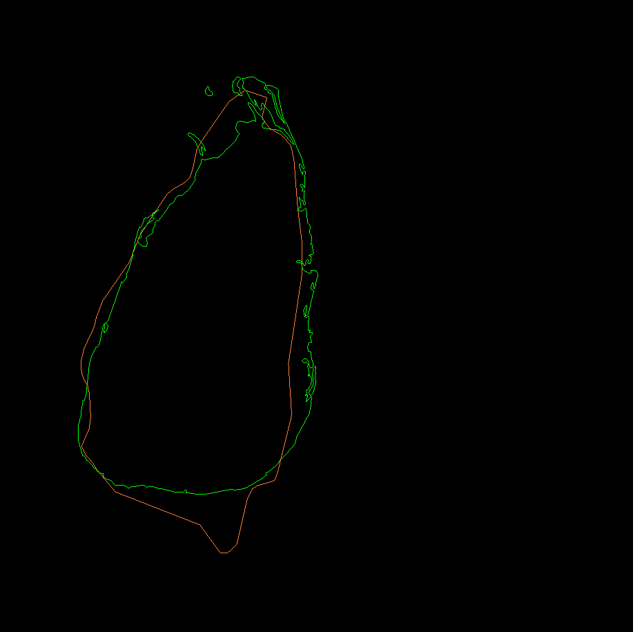

# Country registration

A silly little program to find countries that look alike. Inspired by the brilliant [Map Men](https://www.youtube.com/watch?v=8mrNEVUuZdk). Country data from [Natural Earth Data](https://www.naturalearthdata.com/downloads/10m-cultural-vectors/10m-admin-0-countries/).

Some nice examples:

Kosovo and Montenegro

Saint Lucia and Sri Lanka

## Example Usage

`./country-registration ../data 'Saint Lucia' 'Sri Lanka'`

## Dependencies

* [eigen](https://eigen.tuxfamily.org/index.php?title=Main_Page)
* [gdal](https://gdal.org/)
* [glad](https://github.com/Dav1dde/glad)
* [glfw](https://www.glfw.org/)

## References
* Zhu, J., Xu, S., Hou, J., Li, Y., Wang, J., Lu, H. Effective scaling registration approach by imposing the emphasis on the scale factor. Electronics Letters __54__(7), 422-424 (2018)